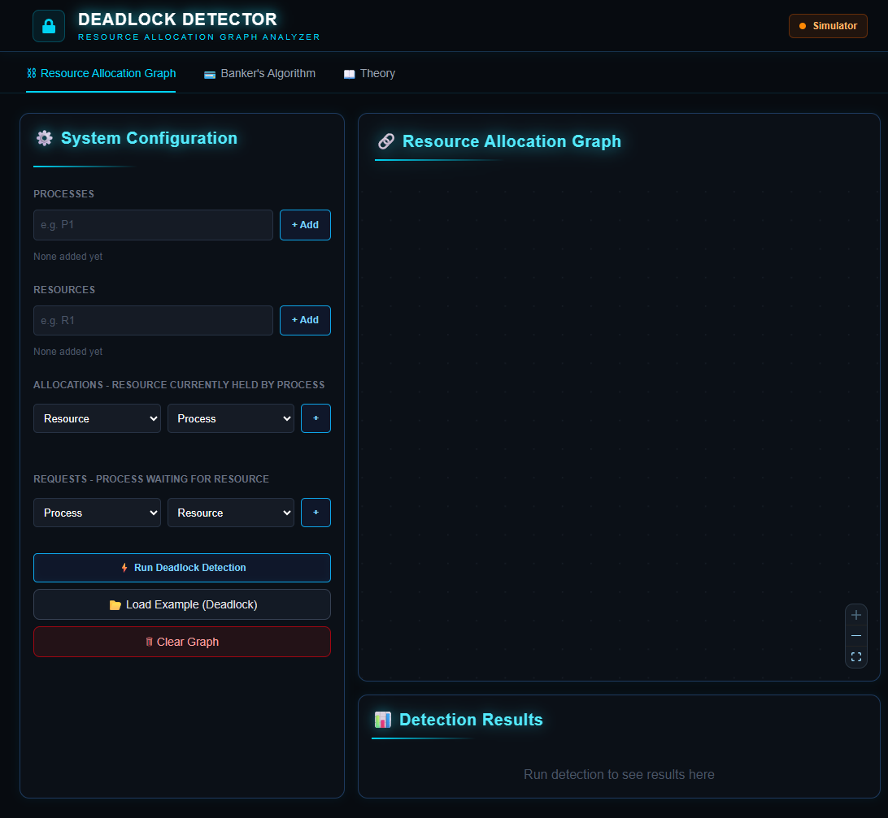
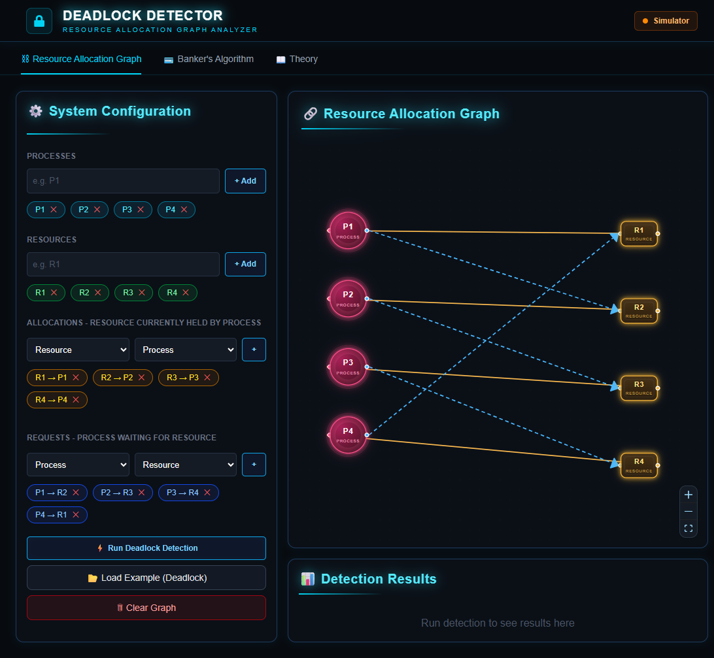
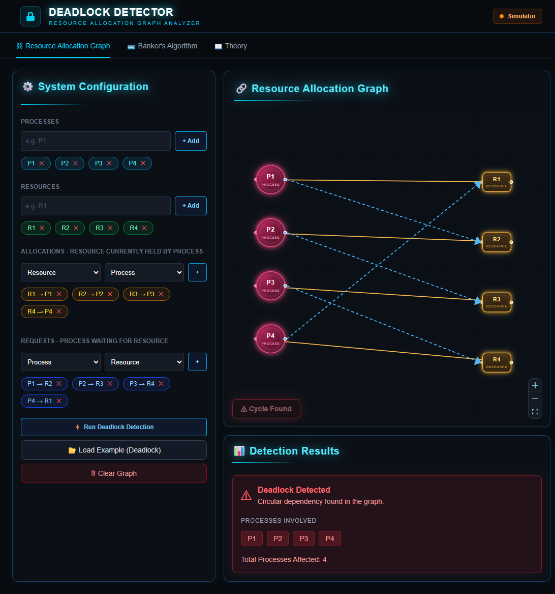
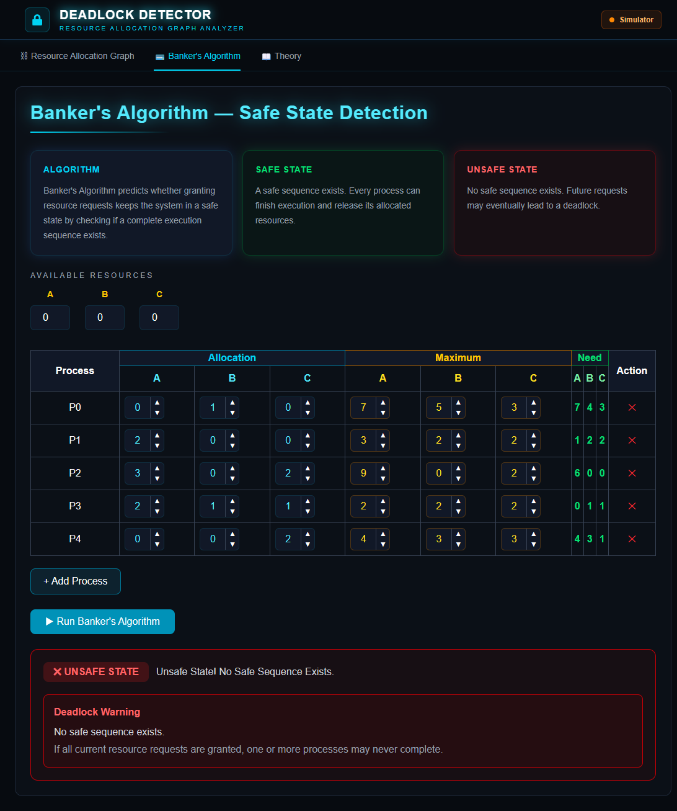
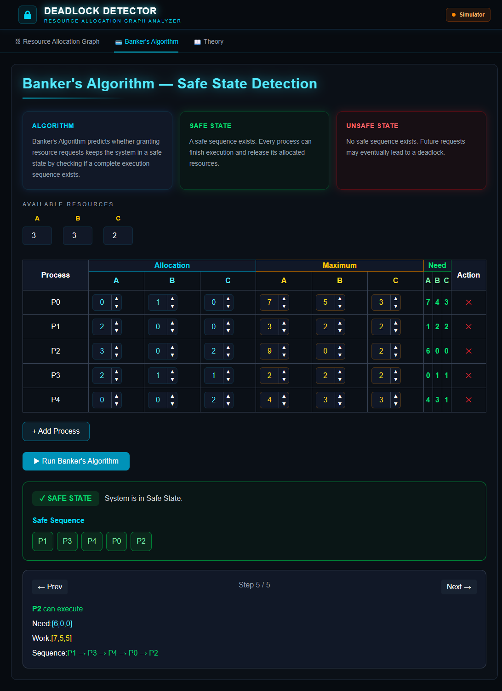
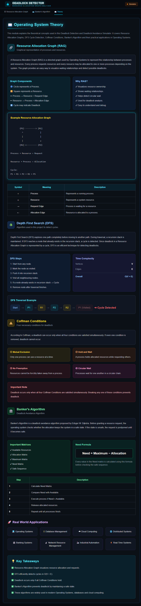

# 🛑 Deadlock Detection Simulator

An interactive web application that demonstrates Operating System deadlock concepts through Resource Allocation Graphs (RAG), Deadlock Detection, and Banker's Algorithm.

## 🚀 Features

- Interactive Resource Allocation Graph
- Real-time Deadlock Detection
- Cycle Detection using DFS
- Banker's Algorithm Simulation
- Operating System Theory Section
- Responsive Modern UI

## 📸 Application Preview
.
### Resource Allocation Graph

### Deadlock Detection

### Banker's Algorithm

### Operating System Theory

## 🛠️ Tech Stack

- React.js
- TypeScript
- Tailwind CSS
- Vite
- React Flow
